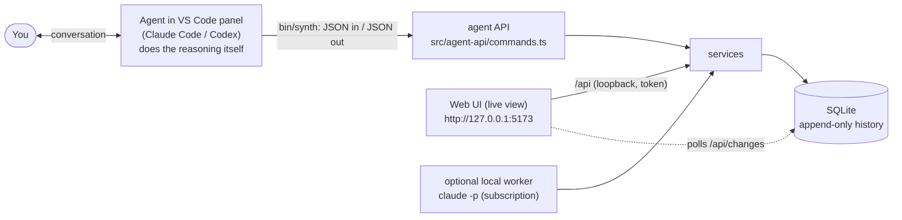

# Developing ideas from a VS Code agent (Claude Code or Codex)

This is the primary way Idea Synth is used. You talk to the coding agent in its VS Code
panel; the agent reads and contributes to Idea Synth through the `synth` CLI; the web page
is a live view of the same state.

> **Two different jobs, do not confuse them.**
> _Using_ Idea Synth to develop an idea = this document. The agent runs `bin/synth ...` and
> never edits files in this repository.
> _Modifying_ Idea Synth's code = `.claude/CLAUDE.md` §1–§10. If the user is talking about
> pyramids, robots or remote work, they are using it, not changing it.



No API key and no second model are involved: the agent you are already talking to does the
reasoning, and the application validates and stores it.

## Setup (once)

```bash
cd ~/idea-synth && npm install
npm run dev            # optional: the live view, http://127.0.0.1:5173 (viewer mode by default)
```

`bin/synth` works from any directory and always uses this repository's database
(`data/idea-synth.sqlite`, or `IDEA_SYNTH_DB`). Optionally `ln -s ~/idea-synth/bin/synth ~/.local/bin/synth`.

## How to ask for it

In a **Claude Code** panel (any workspace; if it is not this repository, give the path):

> Use Idea Synth (`~/idea-synth/bin/synth`, read `~/idea-synth/docs/agent-workflow.md` first)
> to help me develop an idea. Here it is, in my words: "..."

In a **Codex** panel, the same sentence works. Codex reads `AGENTS.md` when the workspace is
this repository, and that file points here. The only difference between the two agents is
the identity they pass: `--agent claude-code` or `--agent codex`.

To continue later, in a brand-new session of either agent:

> Pick up my Idea Synth idea about remote work and innovation.

The agent runs `synth ideas.list` and `synth ideas.context`, and resumes from the stored
history. It does not need, and should not ask for, the earlier conversation.

## Rules for the agent

These are product rules, enforced by the application where possible.

1. **The user's words are the user's.** `author: "user"` means _verbatim_: no tidying,
   summarising or correcting. Captured ideas, guided answers and user messages are
   permanent provenance.
2. **Your words are yours**, even when the user asked for them and approves them. You must
   always say who wrote a text (`author`, `framingAuthor`); a missing author is refused
   rather than assumed to be the user. Rewording an existing item as `author: "user"`
   needs the user's instruction. A split
   whose parts you wrote has `author: "agent"` parts. Accepting your item never makes it
   the user's.
3. **You never decide for the user.** Accept, qualify, reject, split, merge, supersede,
   promote and overriding the review gate are the user's calls. To record one, pass the
   user's own words as `--user-instruction`. Without it the operation is refused. Never
   infer consent from silence, enthusiasm or an earlier, different instruction.
4. **You reason; the application validates.** `passes.next` gives you instructions, the
   idea, a JSON Schema and an `inputVersion`. Produce the JSON yourself and send it with
   `passes.submit`. Output that fails the schema, references unknown items, uses kinds or
   edge types outside the pass's remit, or skips the pass order is refused whole.
5. **Stale work is refused.** Always echo the `inputVersion` **and `promptVersion`** you were
   given: together they bind your output to exactly the context you were served, which the
   application re-creates and stores on the run when it commits (so the history shows what
   you were given, not just what you answered). If the idea
   changed meanwhile (the user decided something in the web UI, another agent wrote), you
   get `details.reason = "stale_input"`: call `passes.next` again and redo the reasoning
   against the new state. Your stale output is kept as history but never published.
6. **Retries reuse the request id.** Every mutating call needs `--request-id` (8+ chars).
   Same request → same id → the stored result is returned (`replayed: true`) and nothing is
   applied twice. A different request needs a new id: reusing an id for different content
   is refused (`details.reason = "request_id_reused"`) and nothing is stored, so never
   number ids in a way that can collide (`answer-1`); include something unique.
7. **Respect the review gate.** After Steps 2–5, stop and work through the `needsUser`
   items _with the user_. Do not proceed to builder/synthesize while the gate is closed
   unless the user explicitly says to, in which case pass
   `"override": {"blockingItemIds": [...]}` naming exactly the items they chose to leave,
   plus their words. An override never covers items that appear later.
8. **Explorer before Skeptic; scaffold before answering.** The pass order is enforced. In
   guided mode the scaffolding level is chosen by code; produce the move at the level you
   are given.
9. **Replies are bound to the thread you read.** An `items.discuss` with
   `author: "agent"` must pass `expectedThreadSeq`: the `seq` of the last message you read
   (`items.get`; 0 for an empty thread). If the user has posted since, the reply is refused
   as stale: re-read and answer what they actually said last.
10. Never write to the SQLite file directly, and never edit this repository while merely
    using the tool.

## The CLI

```bash
synth help                          # all commands
synth schema passes.submit          # JSON Schema of one command's input
synth <command> '<json>'            # small inputs
synth <command> --input file.json   # anything with quotes/newlines (or --input - for stdin)
```

Flags fill `meta`: `--agent`, `--session` (your own session id), `--model` (as far as you
know; stored as a claim), `--request-id`, `--user-instruction`.
Output is one JSON document: `{"ok":true,"data":…}` or
`{"ok":false,"error":{"code","message","details"}}`; exit code 0 or 1.

| Command                                                                           | What it does                                                                                                                                                                    |
| --------------------------------------------------------------------------------- | ------------------------------------------------------------------------------------------------------------------------------------------------------------------------------- |
| `ideas.list`, `ideas.context`, `ideas.graph`, `ideas.history`                     | Discover ideas; focused context (stage, `inputVersion`, gate, what to do next, items, relations, synthesis; `focusItemId` for one item in full); full graph; audit log and runs |
| `items.get`, `synthesis.get`, `gate.check`, `guided.get`                          | One node with provenance, discussion, decisions, revisions, evidence, links, history; a synthesis version; the review gate; a guided transcript                                 |
| `ideas.capture`                                                                   | Step 1: capture exact user text (or an agent-authored idea, labelled as such)                                                                                                   |
| `items.discuss`                                                                   | Append one contribution to a node's thread, as `user` (verbatim) or `agent`                                                                                                     |
| `passes.next` / `passes.submit`                                                   | Get the contract for the next pass / submit the output you produced                                                                                                             |
| `items.decide`                                                                    | Record the **user's** decision (needs `--user-instruction`)                                                                                                                     |
| `items.split`, `items.merge`, `items.supersede`, `items.promote`                  | User-approved structural changes; text carries its true `author`                                                                                                                |
| `items.branch`, `items.revise`, `items.evidence`                                  | Additive contributions an agent may make as itself (it may only reword its own items)                                                                                           |
| `guided.start`, `guided.answer`, `guided.next`, `guided.submit`, `guided.premise` | Guided development: store the user's answer first, then assess it, then produce the move at the code-chosen level                                                               |

## End-to-end: synthesis workflow

```bash
S='--agent claude-code --session my-vscode-session --model claude-fable-5-1'

# 1. Capture - the user's exact words
cat > /tmp/idea.json <<'EOF'
{"author":"user","text":"<paste exactly what the user said>"}
EOF
synth ideas.capture --input /tmp/idea.json $S --request-id cap-7f3a91c2     # -> ideaId, inputVersion

# 2-5. For each of extract, explore, epistemic, adversarial:
synth passes.next '{"ideaId":"idea_…"}'          # instructions + input + outputSchema + inputVersion
#    ... reason in your own conversation, write the JSON ...
synth passes.submit --input /tmp/extract.json $S --request-id ext-51c0de77
#    {"ideaId","pass":"extract","inputVersion":<n>,"promptVersion":"<from passes.next>","output":{...}}

# Review gate: discuss the needsUser items WITH THE USER, in the chat.
synth ideas.context '{"ideaId":"idea_…"}'        # needsUser, gate, next
synth items.discuss --input /tmp/their-reply.json $S --request-id msg-…   # author:"user", verbatim
synth items.discuss --input /tmp/my-reply.json   $S --request-id msg-…   # author:"agent", expectedThreadSeq
synth items.decide '{"itemId":"itm_…","decision":"qualify","qualification":"only where skills transfer"}' \
      $S --request-id dec-… --user-instruction "ok accept that but only where the skills transfer"

# 6-8. When the gate is clear (or the user explicitly overrides):
synth passes.next '{"ideaId":"idea_…"}'          # -> builder, then synthesize
synth passes.submit --input /tmp/synth.json $S --request-id syn-…
synth synthesis.get '{"ideaId":"idea_…"}'
```

The user can watch every step appear in the graph at `http://127.0.0.1:5173`, open any
node, and make decisions there instead; both routes write the same records.

## End-to-end: guided development

```bash
synth guided.start --input /tmp/hypothesis.json $S --request-id gs-…   # {"hypothesis":"<user's words>"}
synth guided.next '{"sessionId":"gs_…"}'        # task "move", at level 1 -> produce the question
synth guided.submit --input /tmp/move.json $S --request-id gm-…
#   ask the user the question in the chat; then, with their exact reply:
synth guided.answer --input /tmp/answer.json $S --request-id ga-…      # stored BEFORE any assessment
synth guided.next '{"sessionId":"gs_…"}'        # task "assessment"
synth guided.submit … ; synth guided.next …     # then task "move" at the level the CODE chose
```

If the user does not know, the level rises one step at a time; at level 5 you supply a
premise, which is stored as **yours** and waits for `guided.premise`
(`accept` / `reject` / `modify` with the user's wording, plus `--user-instruction`).
When the user wants to take it further, just call `passes.next` on the idea: the guided
tree enters the normal workflow and the session is marked handed off.

## What gets recorded about you

Every operation stores: client (`cli`), your `--agent` name, your `--session`, your
self-reported `--model` (marked `self_reported`; the application cannot verify it), the
contract version, the request id, the input version, and any user instruction. Runs you
submit have `authMode: external_session`: the application makes no claim about how your
session is authenticated or billed. Rejected and stale attempts are recorded too.

## A future MCP adapter

`src/agent-api/commands.ts` is a registry of `{ description, mutating, input (zod), run }`
and `describeCommands()` already emits name + description + JSON Schema per command, which
is the shape of an MCP tool list. An MCP server would be a thin stdio wrapper around
`runCommand`; nothing about the contracts needs to change.
