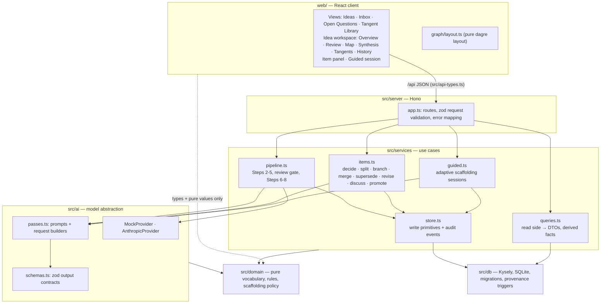
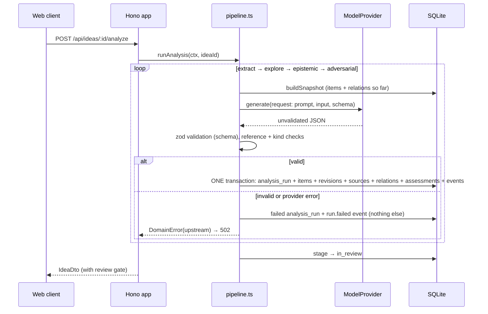
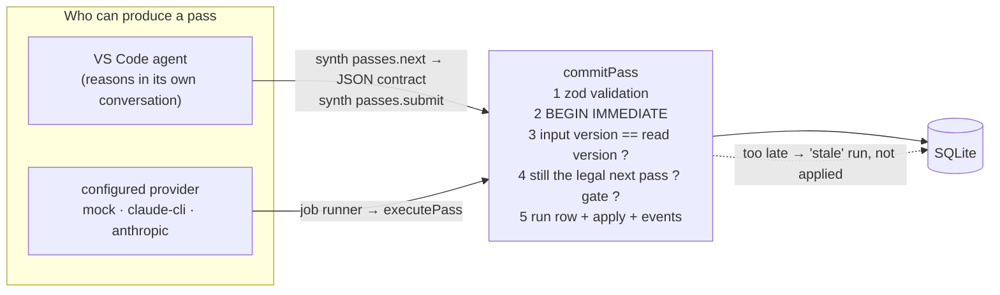

# Architecture

Idea Synth is a modular monolith: one Node process serving a JSON API and (in production
mode) the built web client, backed by one SQLite file. The reasons are in
[ADR 0001](adr/0001-stack.md).

## Layers

Rules of the road:

- `src/domain` has no I/O and imports none of the other layers (enforced by ESLint).
- `src/services/store.ts` is the only place that writes history tables.
- `src/ai/providers/anthropic.ts` is the only file that imports a vendor SDK.
- `src/server/app.ts` contains no reasoning rules.
- `web/` imports types from `src/api-types.ts` and pure constants from `src/domain/`.

## Request lifecycle: running the analysis

A failed pass leaves earlier passes in place and the idea still `captured`; calling analyse
again resumes from the first pass that has not completed.

## Runtime configuration

| Variable                                               | Default                    | Meaning                                                                                     |
| ------------------------------------------------------ | -------------------------- | ------------------------------------------------------------------------------------------- |
| `IDEA_SYNTH_PROVIDER`                                  | `none`                     | Web reasoning: `none` (viewer), `mock`, `claude-cli`, `anthropic`. No fallback between them |
| `IDEA_SYNTH_MODEL`                                     | provider default           | Model alias/id for `claude-cli` or `anthropic`                                              |
| `IDEA_SYNTH_CLAUDE_BIN`, `IDEA_SYNTH_AGENT_TIMEOUT_MS` | `claude`, 8 min            | `claude-cli` provider                                                                       |
| `ANTHROPIC_API_KEY`                                    | —                          | Only for `anthropic`; withheld from the `claude-cli` child                                  |
| `IDEA_SYNTH_DB`                                        | `./data/idea-synth.sqlite` | SQLite file shared by server, workers and CLI (relative to the repo root)                   |
| `IDEA_SYNTH_JOB_CONCURRENCY`                           | `2`                        | Parallel jobs (never more than one per idea)                                                |
| `IDEA_SYNTH_SEED`                                      | on                         | Set `off` to skip seeding an empty database                                                 |
| `HOST` / `PORT`                                        | `127.0.0.1` / `8787`       | Loopback by default; there are no user accounts                                             |

## Clients, and the one way reasoning gets in

- **Input versions.** `ideas.revision` is bumped by every state-changing event. A pass is
  prepared at a version and committed only if the idea is still there; the comparison and
  the writes share one `BEGIN IMMEDIATE` transaction, so it holds across processes (server,
  workers, CLI invocations) and against the user's own concurrent decisions. No transaction
  is ever open during a model call.
- **Operations.** Every client action runs through `applyOperation`, which records an
  append-only envelope (client, session, executor, agent, request id, input version, the
  user's instruction, outcome) and tags every event it causes. Request ids make retries
  idempotent; rejected and stale attempts are kept.
- **Jobs.** Reasoning requested from the browser is a row in the mutable `jobs` table,
  run by an in-process runner (bounded concurrency, one per idea, heartbeat, timeout,
  cancel, recovery after restart). See [local-agent.md](local-agent.md).
- **Live view.** The web client polls `GET /api/changes` (one revision number per idea
  plus the active job count) while visible and refetches only what moved.
- **Local security.** Loopback bind; Host, Origin and Sec-Fetch-Site checks; a per-install
  token on every non-GET; no CORS; no endpoint that takes a command or a path.

## What is deliberately absent

User accounts, multi-user support, streaming, deployment infrastructure, an MCP server
(the agent API is shaped for one), a Codex subscription adapter, and web search for evidence. See [roadmap](roadmap.md).
