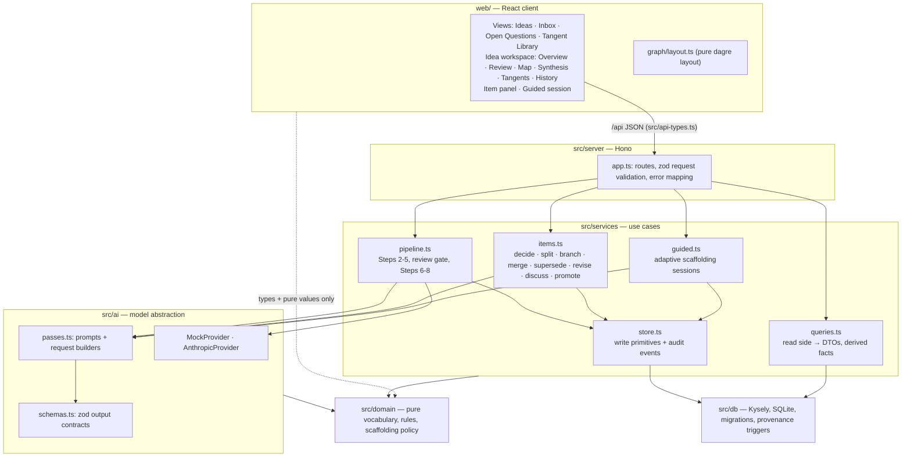
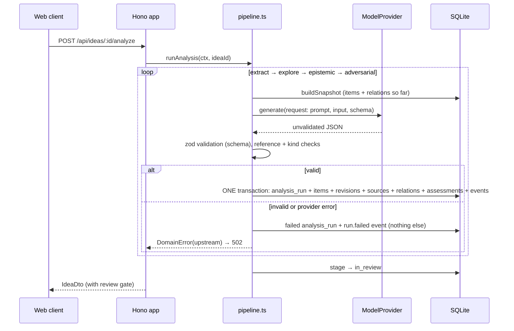

# Architecture

Idea Synth is a modular monolith: one Node process serving a JSON API and (in production
mode) the built web client, backed by one SQLite file. The reasons are in
[ADR 0001](adr/0001-stack.md).

## Layers

Rules of the road:

- `src/domain` has no I/O and imports none of the other layers (enforced by ESLint).
- `src/services/store.ts` is the only place that writes history tables.
- `src/ai/providers/anthropic.ts` is the only file that imports a vendor SDK.
- `src/server/app.ts` contains no reasoning rules.
- `web/` imports types from `src/api-types.ts` and pure constants from `src/domain/`.

## Request lifecycle: running the analysis

A failed pass leaves earlier passes in place and the idea still `captured`; calling analyse
again resumes from the first pass that has not completed.

## Runtime configuration

| Variable              | Default                    | Meaning                                     |
| --------------------- | -------------------------- | ------------------------------------------- |
| `IDEA_SYNTH_PROVIDER` | `mock`                     | `mock` or `anthropic`                       |
| `ANTHROPIC_API_KEY`   | —                          | Needed only for `anthropic`                 |
| `IDEA_SYNTH_MODEL`    | `claude-opus-5`            | Model id for the live provider              |
| `IDEA_SYNTH_DB`       | `./data/idea-synth.sqlite` | SQLite file, or `:memory:`                  |
| `IDEA_SYNTH_SEED`     | on                         | Set `off` to skip seeding an empty database |
| `PORT`                | `8787`                     | API port                                    |

## What is deliberately absent

Authentication, multi-user support, background job queues, streaming, deployment
infrastructure, and web search for evidence. See [roadmap](roadmap.md).
