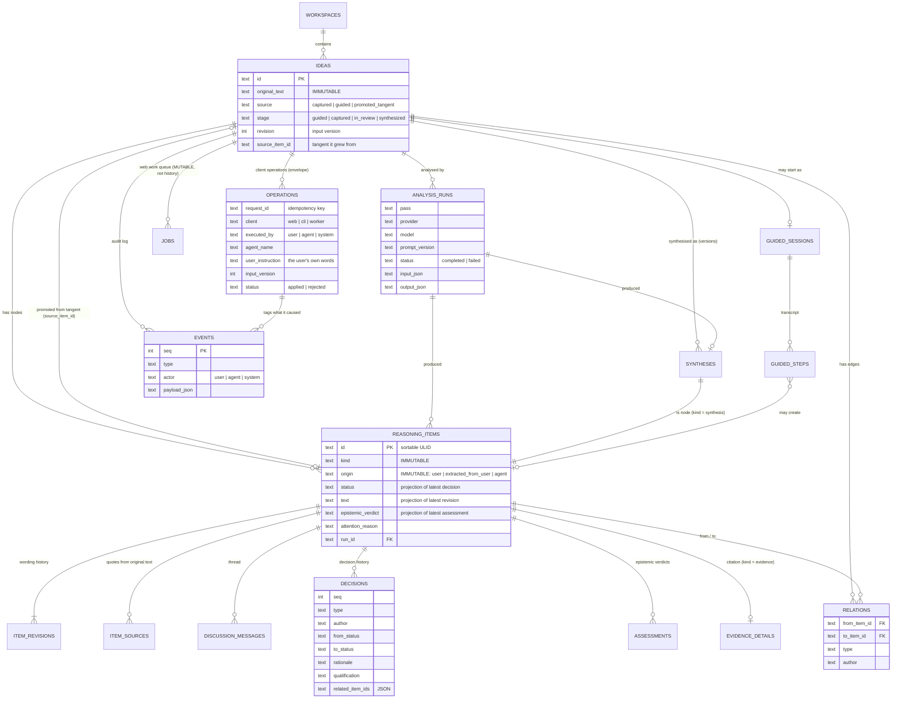

# Domain model, provenance and the idea graph

The model is a **graph of reasoning items with an append-only history**, not
`idea.current_text` plus a chat log. Names below are the real table and type names
(`src/db/schema.ts`, `src/domain/vocabulary.ts`).

## Entities

Terminology against the brief: _ReasoningItem / IdeaNode_ = `reasoning_items`; _Relation /
Edge_ = `relations`; _DiscussionThread_ = the ordered `discussion_messages` of one item
(one thread per item, so no separate thread table); _UserDecision_ = `decisions` (the agent
can also record the two decisions it is allowed); _Evidence_ = an item of kind `evidence`
plus `evidence_details`; _SynthesisRun / AnalysisRun_ = `analysis_runs` (+ `syntheses`).

## Authorship

| `origin`              | Meaning                                                                                                            | UI label        |
| --------------------- | ------------------------------------------------------------------------------------------------------------------ | --------------- |
| `user`                | The user's own words: captured idea, hand-written items, guided answers                                            | USER IDEA       |
| `extracted_from_user` | The agent's restatement of something the user said, tied to a quoted passage                                       | FROM YOUR WORDS |
| `agent`               | The agent's own contribution: implication, extension, objection, correction, evidence, supplied premise, synthesis | AI              |

`origin` is set at creation and frozen by a trigger. Separately, every revision, message,
decision, assessment and relation carries an `author` (`user` | `agent`), and every event
an `actor` (`user` | `agent` | `system`).

## Item kinds

`original_idea`, `factual_claim`, `causal_claim`, `hypothesis`, `assumption`, `analogy`,
`value_judgment`, `definition`, `question`, `inference`, `uncertainty` (extractable);
`implication`, `extension` (Explorer); `objection`, `correction`, `evidence` (Skeptic);
`example`, `test`, `distinction` (Builder); `conclusion`, `synthesis` (Synthesis).

A **tangent** is a status, not a kind: any kind of item can be set aside.

## Statuses

`open` · `needs_user` · `accepted` · `qualified` · `responded` · `rejected` · `tangent` ·
`split` · `merged` · `superseded`. `responded` means the user answered something the agent
asked (attention reasons `clarification_needed`, `value_judgment_input`,
`ambiguous_interpretation`, or an agent question); unlike `accepted` it says nothing about
the item's statement. The last three are structural and final (continue with the items
they produced). Everything else can be reopened. `original_idea` and `synthesis` items are
records of the process and cannot be accepted or rejected.

## Relation types

An edge reads **`from --type--> to`**. `flow` is used by the map layout: `reverse` means
`to` arose first (the edge points back at what it is about), `forward` means `from` arose
first.

| Type               | Reads as                                             | Flow    | Genealogical |
| ------------------ | ---------------------------------------------------- | ------- | ------------ |
| `derived_from`     | child → the item it was derived/extracted/split from | reverse | yes          |
| `branches_to`      | parent → new item branched from it                   | forward | yes          |
| `tangent_of`       | tangent → the item it wandered off from              | reverse | yes          |
| `supersedes`       | new formulation → the one it replaces                | reverse | yes          |
| `merged_into`      | merged source → the merged item                      | forward | yes          |
| `synthesized_into` | source → conclusion, conclusion → synthesis          | forward | yes          |
| `answers`          | answer / supplied premise → the question             | reverse | yes          |
| `supports`         | supporting item → what it supports                   | reverse | no           |
| `contradicts`      | objection → what it contradicts                      | reverse | no           |
| `qualifies`        | qualification → what it limits                       | reverse | no           |
| `questions`        | question → what it asks about                        | reverse | no           |
| `corrects`         | correction → the claim it corrects                   | reverse | no           |
| `assumes`          | claim → the assumption it rests on                   | forward | no           |
| `evidence_for`     | evidence → the claim                                 | reverse | no           |
| `evidence_against` | evidence → the claim                                 | reverse | no           |

Genealogical edges may never form a cycle (`wouldCreateGenealogyCycle`); argumentative
edges may (two items can contradict each other). Edges are append-only and unique per
`(from, to, type)`. `answers` and `merged_into` extend the list in the original brief.

Cross-idea genealogy (a promoted tangent) is stored on the idea
(`source_idea_id`, `source_item_id`) rather than as an edge, so each idea's graph stays
self-contained.

## How history is kept

| Change                                              | Record (append-only)                                                            | Projection updated             |
| --------------------------------------------------- | ------------------------------------------------------------------------------- | ------------------------------ |
| Item created                                        | `item_revisions` seq 1, `item_sources`, `events: item.created`                  | —                              |
| Reworded                                            | `item_revisions` (author, reason, `caused_by_item_id`)                          | `reasoning_items.text`         |
| Accept / qualify / reject / reopen / tangent / flag | `decisions` (from → to, rationale, qualification)                               | `.status`, `.attention_reason` |
| Split / merge / supersede                           | new items + `relations` + `decisions` with `related_item_ids`                   | source `.status`               |
| Fact-checked                                        | `assessments`                                                                   | `.epistemic_verdict`           |
| Discussed                                           | `discussion_messages` (per-item `seq`)                                          | —                              |
| Evidence attached                                   | `evidence` item + `evidence_details` + edge                                     | —                              |
| Pass run                                            | `analysis_runs` (input, validated output, provider, model, prompt version)      | —                              |
| Synthesised                                         | `syntheses` version + `synthesis`/`conclusion` items + `synthesized_into` edges | `ideas.stage`                  |
| Anything                                            | `events`                                                                        | —                              |

Triggers abort UPDATE/DELETE on every table in the middle column, on
`ideas.original_text`, and on an item's `origin`/`kind`. See
[ADR 0001](adr/0001-stack.md) for why this is event-_logged_ rather than event-_sourced_.

## Author, approver, executor

Three facts about "who", stored separately and never merged:

| Fact         | Question                                   | Where                                                                                                                                                    |
| ------------ | ------------------------------------------ | -------------------------------------------------------------------------------------------------------------------------------------------------------- |
| **Author**   | Whose words are these?                     | `reasoning_items.origin` (frozen); `author` on revisions, messages, relations                                                                            |
| **Approver** | Who made this judgement call?              | `decisions.author` — always `user` for accept / qualify / reject / split / merge / supersede; the agent may only flag or set aside                       |
| **Executor** | Who performed the operation, through what? | `operations` (client `web`/`cli`/`worker`, session, `executed_by`, agent name, self-reported model, contract version), linked from `events.operation_id` |

When an agent executes a user's decision, `decisions.relayed_by` names the agent and
`decisions.user_instruction` keeps the user's own words; without them the operation is
refused. Text the agent wrote stays `origin = agent` through any amount of approval or
restructuring: a user-approved split can have agent-authored children, a user-approved
supersede can install an agent-authored formulation. An agent may reword only items it
originated. User-authored text (captures, answers, messages, user-written items) is stored
byte for byte; only emptiness is validated.

## Input versions and operations

`ideas.revision` increases with every state-changing event, in the same transaction.
Anything computed from the idea records the version it read (`analysis_runs.input_version`,
`operations.input_version`) and is applied only if the idea is still at that version.
Output that arrives too late is stored as an `analysis_runs` row with `status = 'stale'`
(plus a rejected `operations` row): history, never current reasoning.

`operations.request_id` is unique among applied operations: repeating a request returns the
stored result instead of applying it again. `jobs` (the web work queue) is mutable
operational state and is not part of the provenance model.

## Answering the provenance questions

| Question                                        | Where the answer is                                                                                    |
| ----------------------------------------------- | ------------------------------------------------------------------------------------------------------ |
| Where did this conclusion come from?            | `synthesized_into` edges into the conclusion; `syntheses.body_json` refs; then each source's own links |
| User's thought or the AI's?                     | `reasoning_items.origin` (frozen)                                                                      |
| Which original statement produced this tangent? | follow `tangent_of` / `derived_from` to an extracted item, then its `item_sources` quote and offsets   |
| What objection caused this idea to change?      | `item_revisions.caused_by_item_id`, or the `supersedes` edge + `item.superseded` event                 |
| Why was this claim rejected?                    | `decisions` row (rationale) + `assessments` + `corrects` edges                                         |
| What did the user say in response?              | `discussion_messages` for that item, ordered by `seq`, with author                                     |
| Which evidence was considered?                  | incoming `evidence_for` / `evidence_against` edges + `evidence_details`                                |
| Did one item split into three?                  | `decisions.type = split` with `related_item_ids`; children `derived_from` the parent                   |
| What did this synthesis supersede?              | `supersedes` edge between `synthesis` items; `syntheses.version`                                       |

`GET /api/items/:id` returns all of this for one node in a single `ItemDetailDto`.
