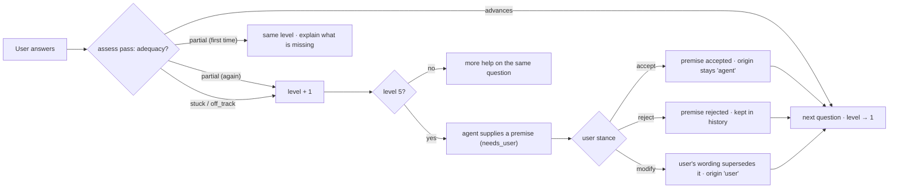

# Guided Idea Development

A separate mode from the synthesis pipeline: the agent helps someone develop a hypothesis
by asking progressively more useful questions, and teaches missing background when needed,
rather than answering for them.

## Adaptive scaffolding levels

| Level | Name              | What the agent does                                                                        |
| ----- | ----------------- | ------------------------------------------------------------------------------------------ |
| 1     | Open question     | Ask an open question.                                                                      |
| 2     | Narrowed question | Narrow the question or name the relevant dimension.                                        |
| 3     | Structure         | Offer a structure, analogy, distinction or partial premise; teach background if needed.    |
| 4     | Options           | Offer several possibilities and ask the user to evaluate them.                             |
| 5     | Supplied answer   | Give a likely answer, **labelled as agent-supplied**, and ask whether the user accepts it. |

The goal is not endless Socratic questioning. A user may simply lack domain knowledge; by
level 3 the agent teaches, and by level 5 it supplies an answer so reasoning can continue.

## The level is chosen by code, not by the model

`nextScaffoldLevel` in `src/domain/scaffolding.ts`:

Each user reply triggers two `tutor` passes: **assess** (how far did this answer move the
reasoning, why, and what kind of answer would help) and **move** (produce the next move _at
the level the policy selected_). A model that supplies an answer below level 5 fails
validation.

## What is recorded

`guided_steps` is the complete transcript: author, step kind (`question`, `answer`,
`feedback`, `teaching`, `options`, `supplied_premise`, `premise_response`), scaffolding
level, adequacy, and the user's stance on supplied premises.

Turns that carry reasoning content also become items in the idea's graph:

| Turn                                               | Item                                                                    | Origin                 |
| -------------------------------------------------- | ----------------------------------------------------------------------- | ---------------------- |
| The hypothesis                                     | `original_idea` root                                                    | `user`                 |
| A new tutor question                               | `question`, `questions` → root (and `derived_from` the previous answer) | `agent`                |
| A substantive user answer (`advances` / `partial`) | the user's **exact words**, `answers` → question                        | `user`                 |
| "I don't know"                                     | no item (transcript only)                                               | —                      |
| A level-5 supplied premise                         | `needs_user` until answered, `answers` → question                       | `agent` — **for ever** |
| User modifies the premise                          | new item that `supersedes` the agent's                                  | `user`                 |

Accepting an agent-supplied premise records an `accept` decision by the user. It never
changes the premise's origin: the history always shows the AI supplied it and the user
agreed.

## Entering the synthesis workflow

"Take this into synthesis" runs Steps 2–5 on the same idea. The guided items stay in the
graph next to the newly extracted ones, so the normal review gate, Builder and Synthesis
work over the whole tree.

## Demo behaviour

With the mock provider the "robots" hypothesis is fully scripted at all five levels; any
other hypothesis gets generic templates. The mock judges adequacy with simple documented
heuristics (`src/ai/mock/tutor.ts`): "I don't know"-style answers are `stuck`; one or two
words to an open question is `partial`; anything else `advances`.
