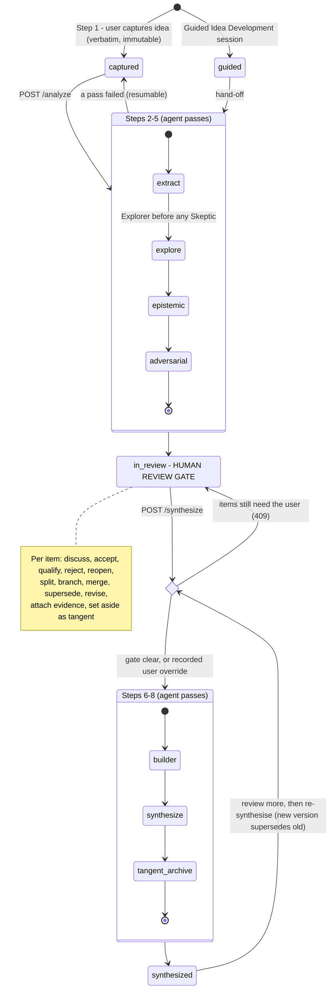

# The eight-stage synthesis workflow

> AI should scaffold reasoning rather than silently do the reasoning for the user.

| #   | Stage                         | Who                              | Pass (`analysis_runs.pass`) | Role                                                       |
| --- | ----------------------------- | -------------------------------- | --------------------------- | ---------------------------------------------------------- |
| 1   | Capture                       | **User**                         | —                           | —                                                          |
| 2   | Extract                       | Agent                            | `extract`                   | neutral                                                    |
| 3   | Explore / Branch              | Agent                            | `explore`                   | **Explorer** — "What else follows from this?"              |
| 4   | Fact check / epistemic review | Agent                            | `epistemic`                 | **Skeptic**                                                |
| 5   | Adversarial review            | Agent                            | `adversarial`               | **Skeptic** — "What here is not actually justified?"       |
| —   | **Human review gate**         | **User** (+ agent in discussion) | `discuss`                   | —                                                          |
| 6   | Collaborative review          | Agent                            | `builder`                   | **Builder** — "What is the strongest interesting version?" |
| 7   | Synthesis                     | Agent                            | `synthesize`                | Builder                                                    |
| 8   | Tangent archive               | Agent                            | (part of `synthesize`)      | —                                                          |

The Explorer runs **before** either sceptical pass on purpose: premature criticism destroys
productive branches before they are captured. A test (`tests/pipeline.test.ts`) pins this
order.

## Lifecycle

## Stage by stage

**1 · Capture.** The text is stored byte-for-byte in `ideas.original_text` and as the root
`original_idea` item (`origin = user`). Triggers make both immutable. Nothing is trimmed or
tidied.

**2 · Extract.** Produces atomic items (`factual_claim`, `causal_claim`, `hypothesis`,
`assumption`, `analogy`, `value_judgment`, `definition`, `question`, `inference`,
`uncertainty`) with `origin = extracted_from_user`. Each must quote its source passage
verbatim; quotes are stored with character offsets (`item_sources`). Each is linked
`derived_from` the root or another extracted item. Extraction implies nothing about truth.

An item is only labelled `extracted_from_user` if the captured text is the user's own
**and** at least one quote is found in it (exactly, or after normalising whitespace and
typographic quotes; offsets always point into the real text). An "extraction" with no
locatable quote is stored as the **agent's** item and put to the user (`needs_user`,
`clarification_needed`). When the idea is an un-reframed promoted tangent that the agent
wrote, everything extracted from it is `agent` too.

**3 · Explore.** Asks _"What interesting ideas follow from this even if one or more
premises later turn out to be false?"_ Produces `implication` (follows from the user's
idea), `extension` (AI-proposed), `analogy`, `question`, `hypothesis` — all `origin =
agent`. Off-topic-but-interesting items are flagged `is_tangent` and go straight to the
tangent library with a `tangent_of` edge.

**4 · Epistemic review.** One verdict per checked item: `well_supported`,
`plausible_uncertain`, `disputed`, `unsupported`, `misleading_framing`, `probably_false`,
`false`, `normative`, `requires_clarification`. The claim itself is never edited; a
separate `correction` item is linked with `corrects`. Evidence becomes `evidence` items
with citation details, linked `evidence_for` / `evidence_against`. Value judgements are
flagged for the user's view rather than ruled on.

**5 · Adversarial review.** Objections, hidden assumptions, alternative explanations,
ambiguities, "what would change the conclusion" questions. Attacks the argument, never the
person, and distinguishes _wrong_ from _insufficiently supported_.

**Review gate.** Items the agent needs the user for have status `needs_user` and an
`attention_reason` (`disputed_correction`, `unresolved_objection`, `unresolved_assumption`,
`value_judgment_input`, `ambiguous_interpretation`, `clarification_needed`,
`premise_needs_response`, `decision_required`). Each item has its own persistent discussion
thread. `needs_user` items block Steps 6–8; `open` items do not (they surface as open
questions). The user may override the gate; the override is logged as `gate.overridden`.
The binding gate check happens **inside the transaction that commits the synthesis**, so
an item that starts needing the user while the model is working still blocks, and an
override is only ever recorded together with the synthesis it authorised.

Possible outcomes for an item:

| Outcome                                               | How                     | Result                                                     |
| ----------------------------------------------------- | ----------------------- | ---------------------------------------------------------- |
| remain open                                           | do nothing / `reopen`   | `open`                                                     |
| require user input                                    | agent `flag_needs_user` | `needs_user`                                               |
| accepted                                              | `accept`                | `accepted` (into the current reasoning state — not "true") |
| accepted with qualification                           | `qualify` + text        | `qualified`; the qualification is fed to the Builder       |
| rejected                                              | `reject`                | `rejected`; thread, decisions and children all remain      |
| superseded                                            | `supersede`             | old item `superseded`, new item `supersedes` it            |
| become a tangent                                      | `mark_tangent`          | `tangent`, appears in the Tangent Library                  |
| merged                                                | merge                   | sources `merged`, each `merged_into` the new item          |
| split                                                 | split                   | parent `split`, children `derived_from` it                 |
| produce a hypothesis / correction / research question | branch                  | new child via `branches_to`; parent unchanged              |

**False premise, productive idea.** Not a stored status. An item whose premise failed
(rejected by the user, or verdict `false` / `probably_false`) gets this label when at least
one idea that _arose from it_ (via `derived_from`, `branches_to`, `tangent_of`, `questions`,
`answers`, transitively) is still open, accepted, qualified or a tangent. Rejection never
cascades to children.

**6 · Builder.** Works only from survivors, respecting qualifications. Adds better
formulations, `example`, `test`, `distinction`, connections and better questions. Builder
items are proposals (`open`), not conclusions, and can never be `needs_user`: the Builder
must not re-close the gate behind the user's back. If the synthesis step fails, a retry
reuses the Builder run instead of generating duplicates.

**7 · Synthesis.** A `synthesis` item plus `conclusion` items, and a structured body:
what you initially thought · what changed · what was rejected · what remains uncertain ·
conclusions that survive · evidence · open questions. **Every line lists the item ids it
rests on**; a line with no references fails validation. Sources link to conclusions and
conclusions to the synthesis with `synthesized_into`. A new synthesis `supersedes` the
previous one; earlier versions stay readable.

**8 · Tangent archive.** Open, off-main-line items are set aside as tangents (never items
the user has ruled on). Any tangent can be promoted to a new idea, which records the item
it grew from and **keeps that item's authorship** unless the user reframes it in their own
words.
